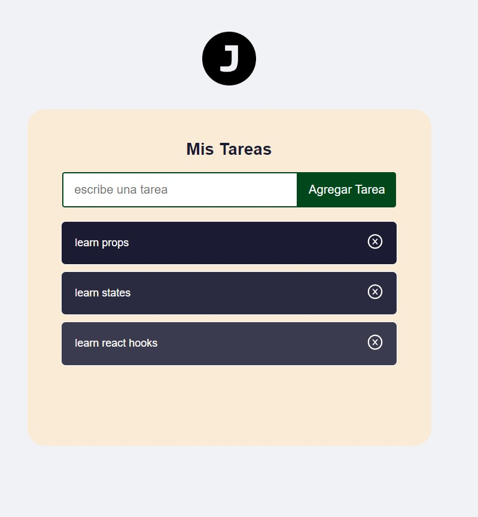

# Agenda para practicar conceptos basicos de react.

## video tutorial youtube freecodecamp.

### creditos: _Estefania Cassingena Navone_ (@EstefaniaCassN)

---

#### conceptos:

- elmentos.
- props.
- componentes
  - de clase.
  - funcionales.
- hooks.

---

**vista previa**: 
